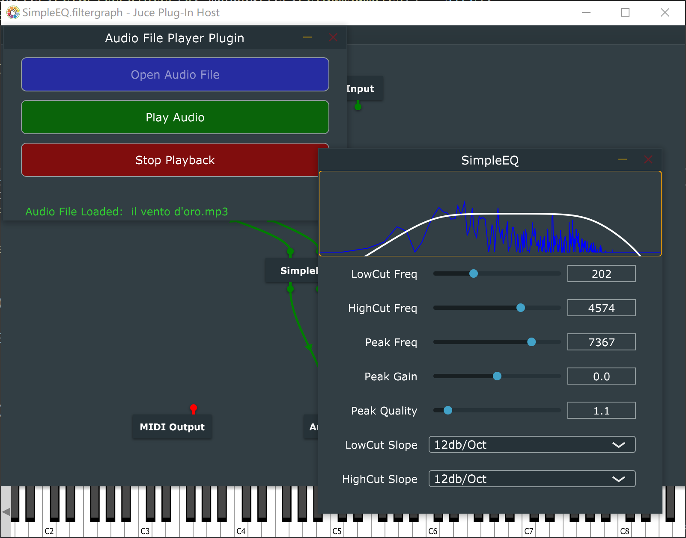

## SimpleEQ VST3 plugin

A simple 3-band EQ plugin with spectrum analyzer builded with [JUCE](https://github.com/juce-framework/JUCE). Available as VST3 in Windows. Most of the code is from the MatkatMusic's C++ tutorials(https://github.com/matkatmusic/SimpleEQ).

## Download

Just download the vst3 file and put it into the vst3 path.

## Build

See [JUCE](https://github.com/juce-framework/JUCE) for more detail.